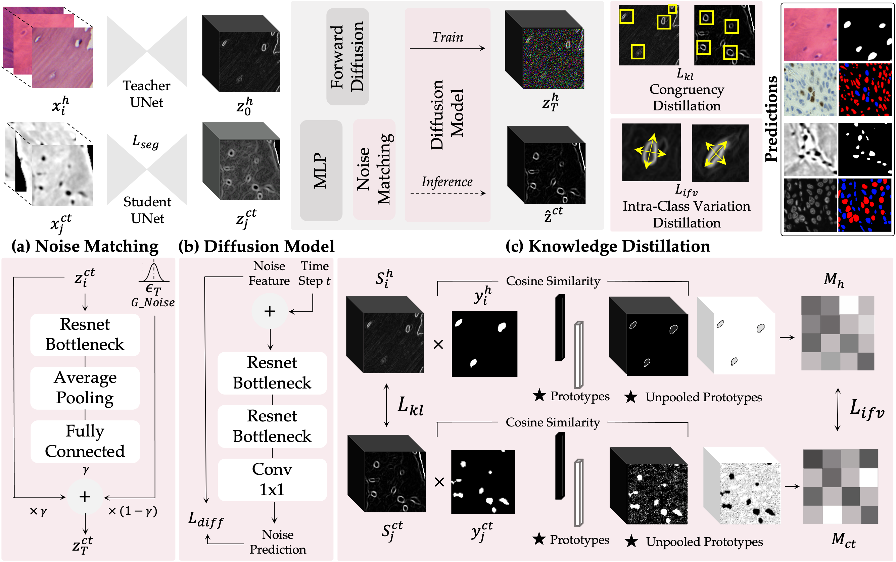

# 🪷 LOTUS

## Introduction

This is the implementation for the MICCAI'24 paper **"Letting Osteocytes Teach SR-microCT Bone Lacunae Segmentation: A Feature Variation Distillation Method via Diffusion Denoising"**. 



## Data Preparation

- **Dataset**

We collect a new dataset, BonesAI, of H&E histopathologies and SR-microCT images of bone femoral heads. H&E histopathologies are decorated with 1343 osteocyte cell segmentations, while SR-microCT has ~32.1k lacunar structures. Given their interdependence, we learn lacunae segmentation from SR-microCTs while integrating osteocyte histopathological information. We have separated our in-house dataset at the patient level and maintained a training-validation-test set ratio of approximately 8:1:1. While we cannot disclose our dataset yet, we are working to facilitate its accessibility.

We also tested our strategy on the [DeepLIIF](https://zenodo.org/records/4751737#.YKRTS0NKhH4) dataset. Given the more complex analysis of DAPI + mpIF fluorescence images, we aim to aid their cell segmentation with knowledge transfer from its immunochemistry (IHC) complementary modality. We adopted the training-validation-test set ratio of the original dataset version.  
  
- **Data Preprocessing**

We do not apply pre-processing to the BonesAI H&E histopathologies, while for SR-microCTs we followed the methodology outlined in [[1]](https://ieeexplore.ieee.org/abstract/document/10313398?casa_token=2R2EPYzR7VUAAAAA:Sy-QSysA2AXj86PsIkJEXRHiFb7SzXctskTe5BiaBPlXbQpeWhsvxre-GMa2mogWnk2yBsYySw)-[[2]](https://ieeexplore.ieee.org/abstract/document/10341140?casa_token=S1e6AOnA9EgAAAAA:tPj1YdQTnUmw6zYGUBt9fcdW5IIEN7I1Fq7RvFEjhv6_YmBIsGwvH3s_xaeHBOTgVZYoO3ynqg). In particular, we classify images into two sets based on gray level ranges: [0, 1] and [-1, 0], the latter originating from acquisition errors. Subsequently, a 3-step enhancement pipeline (1. normalization+clipping, 2. Otsu+K-means segmentation, 3. image masking) is applied to extract the bone image content. 

For DeepLIIF images, we do not apply pre-processing to the IHC images, but we merged the DAPI and mpIF, considering the maximum pixel-wise value between the two.

We used data augmentation, including random crop, flip, rotation, contrast, saturation, and brightness changes. All the images are resized to 512×512 before feeding into the network.

- **Structure of data folder**

```
LOTUS                             # your WRK_DIR
.
├── ...
├──data/                          # data dir
  ├── bonesai-histo/              # BonesAI H&E histopathologies
  │   └── sample_n/               # Bone sample dir
  │       ├── mask binary/        # Osteocytes manual segmentations
  │       │   └── mask.png
  │       └── tissue images/      # WSI H&E histopathologies
  │           └── histo.tif
  ├── bonesai-microct/            # BonesAI SR-microCT
  │   └── sample_n/               # Bone sample dir
  │       ├── mask binary/        # Lacunae manual segmentations
  │       │   └── mask.png
  │       └── tissue images/      # WSI SR-microCT
  │           └── microct.tif
  └── DeepLIIF-mm/                # DeepLIIF dataset
      ├── ihc/                    # DeepLIIF Immunochemistry (IHC) 
      │   ├── train/              # IHC DeepLIIF training dataset
      │   │   ├── masks/          # DeepLIIF training ground-truth segmentations patches
      │   │   │   └── mask.png
      │   │   └── tissue images/  # IHC DeepLIIF training patches
      │   │         └── ihc.png
      │   ├── val/                # IHC DeepLIIF validation dataset
      │   └── test/               # IHC DeepLIIF testing dataset
      ├── dapi/                   # DeepLIIF DAPI 
      └── pm/                     # DeepLIIF mpIF 
```

## Implementation

**1. Hardware pre-requisites**

We run our training-validation-testing experiments on an AMD Ryzen 7 5800X @3.8 GHz with a 24 GB NVIDIA RTX A5000 GPU. Different hardware configurations have shown slight performance variations (1-2%). 

**2. Dependencies**

- Ubuntu 20.04.6 LTS
- Python 3.8.10
- CUDA Driver Version 12.3
- Clone this repo: 

```bash
git clone https://github.com/isabellapoles/LOTUS.git
cd LOTUS
```
- Create an environment and install dependencies:
```bash
python3 -m venv <venv>
source <venv>/bin/activate
pip3 install -r requirements.txt
```

**3. Train the model**

First, we trained the osteocyte segmentation single-modal model (*teacher* model) with H&E.
It comes pre-trained on the [NuInsSeg](https://www.kaggle.com/datasets/ipateam/nuinsseg) dataset. 
```
python3 train_t_bonesai.py --checkpoint-path './checkpoint/bonesai' \
                          --dataset-path './data' \
                          --model_configs 'config_t_bonesai.py' \
```
Next, the histopathology-enhanced model for lacunae segmentation (*student* model) on SR-microCT images is trained.
```
python3 train_s_bonesai.py --checkpoint-path './checkpoint/bonesai' \
                          --dataset-path './data' \
                          --model_configs 'config_s_bonesai.py' \
```
The model parameters, hyperparameters, pre-trained weights, and checkpoint variables to be used for the *teacher* and the *student* have to be specified in the `configs/config_x_bonesai.py` file variables.     

The same holds if you want to reproduce the results with the DeepLIIF dataset. 
First, we pretrained the segmentation single-modal model (*teacher* model) with IHC.
```
python3 train_t_deepliif.py --checkpoint-path './checkpoint/DeepLIIF' \
                            --dataset-path './data' \
                            --model_configs 'config_t_deepliif.py' \
```
Next, the IHC-enhanced model for cell segmentation (*student* model) on DAPI images is trained.

```
python3 train_s_deepliif.py --checkpoint-path './checkpoint/DeepLIIF' \
                            --dataset-path './data' \
                            --model_configs 'config_s_deepliif.py' \
```
The model parameters, hyperparameters, pre-trained weights, and checkpoint variables to be used for the *teacher* and the *student* have to be specified in the `configs/config_x_deepliif.py` file variables. 

**4. Test the model** 

To test the *student* lacunae segmentation model on SR-microCT: 
```
python3 test_bonesai.py --checkpoint-path './checkpoint/bonesai' \
                        --dataset-path './data' \
                        --model_configs 'config_s_bonesai.py' \
```
To test the *student* cell segmentation model on DAPI IF images: 
```
python3 test_deepliif.py --checkpoint-path './checkpoint/DeepLIIF' \
                        --dataset-path './data' \
                        --model_configs 'config_s_deepliif.py' \
```
The model's pre-trained weights and checkpoint variables for the *student* must be specified in the `configs/config_s_bonesai.py` and `configs/config_s_deepliif.py` files variables. 

**5. Model weights** 

Model weights are available in the `./checkpoint` directory. 

### Citation
If you find our work useful in your research, please consider citing our paper:
```
@inproceedings{poles2024letting,
  title={Letting Osteocytes Teach SR-MicroCT Bone Lacunae Segmentation: A Feature Variation Distillation Method via Diffusion Denoising},
  author={Poles, Isabella and Santambrogio, Marco D and D’Arnese, Eleonora},
  booktitle={International Conference on Medical Image Computing and Computer-Assisted Intervention},
  pages={383--393},
  year={2024},
  organization={Springer}
}
```

### Acknowledgments
This work was supported by the Polisocial Award 2022 - Politecnico di Milano.
The authors acknowledge F. Buccino and M. Vergani for their expertise on bone lacunae and osteocyte mechanics, Elettra Sincrotrone Trieste for providing access to its synchrotron radiation facilities, A. Zeni and D. Conficconi for valuable suggestions and discussions and NVIDIA Corporation for the Academic Hardware Grant Program. 

Parts of our code are taken from [DiffKD](https://github.com/hunto/DiffKD).

### Contact
Isabella Poles (isabella.poles@polimi.it), 
Eleonora D'Arnese (eleonora.darnese@polimi.it)